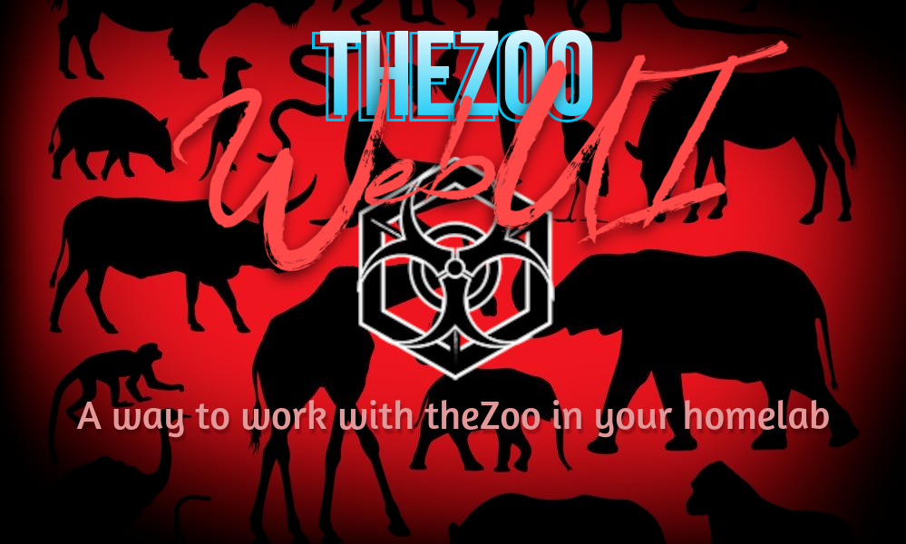

# ᵔᴥᵔ theZoo WebUI

[](https://twitter.com/davidbl) [](https://github.com/kawaiipantsu/theZoo-WebUI/issues) [](https://github.com/kawaiipantsu/theZoo-WebUI/issues) [](https://github.com/kawaiipantsu/theZoo-WebUI/blob/master/LICENSE) [](https://github.com/kawaiipantsu/theZoo-WebUI/network) [](https://github.com/kawaiipantsu/theZoo-WebUI/stargazers)
> theZoo-WebUI is bringing your favorite theZoo LIVE malware repo into your browser for your own joy and pleasure. theZoo is a project created to make the possibility of malware analysis open and available to the public. This WebUI is a way to make it even more useful in your homelab to quickly have a small webserver for distribution or search etc.



---

## Join the community


Join the community of Kawaiipantsu / THUGS(red) and participate in dev talk or simply just come visit us and chat about anything security related :) We love playing around with security. Also we enjoy htb/ctf events and welcome new players to learn what its all about.

**THUGS(red) Discord**: <https://discord.gg/Xg2jMdvss9>

## Table of contents

 - [Requirements](#requirements)
 - [Installation](#installation)
   - [Installing Apache+PHP+GIT+Python](#installing-apache-php-git-python)
   - [Downloading the theZoo and theZoo WebUI](#downloading-the-thezoo-and-thezoo-webui)
   - [Setting up theZoo](#setting-up-thezoo)
   - [Done](#done)
 - [theZoo EULA](#thezoo-eula)
 - [theZoo and malware database](#thezoo-and-malware-database)

## Requirements

I've tried to keep it simple, but i do rely on you knowning just a little bit of knowlegde about web servers and how they work. As i won't be covering that part AT ALL! However this is all very straight forward so don't worry.

- OS of choice (Most Linux dists will do)
- Webserver of choice that can interpered PHP 7.x+
- PHP 7.x+ with following extensions enabled
  - SQLite
  - cURL
  - Zip
- Git
- Python
- Not to expose it on the public internet (Eh please?)


## Installation

I tryed to throw together a quick package line by line for Debian 10/11+ This should work with most distributions and your local package manager. Perhaps the packages are called something else. Also you should know all of this by heart and kinda just look over the reuiqrements and already have a good idea what to do!

### Installing Apache+PHP+GIT+Python

```shell
# Make sure we are updated
apt update

# Install webserver and PHP and GIT
apt install apache2 libapache2-mod-php git python

# PHP Extensions/Modules
apt install php-curl php-zip php-sqlite3
```

Yes you cancombind it all in one install, i just wanted to make it clear what i did. You might need to `sudo`the crap out of those commands if you unlike me use none-root users...

### Downloading the theZoo and theZoo WebUI

```shell
cd /var/www/html && rm -f index.html
git clone https://github.com/kawaiipantsu/theZoo-WebUI.git .
git clone https://www.github.com/ytisf/theZoo
chown -R www-data:www-data /var/www/html 
```

As always, if you unlike me keep it to none-root users you might need to `sudo` some of the above steps! You know what to do kiddo i wont tell you! Also why do i use full paths when i `chown` or `chmod` ? I usually always do that when i do recursive changes just to make sure i don't mess up. So now you know!

### Setting up theZoo

You could just refere to their own repo, that might be best in case they change the process for setting/installing it.

- https://github.com/ytisf/theZoo#getting-started

But here is the basic rundown!

```shell
cd theZoo
pip install --user -r requirements.txt
python theZoo.py
```

### Done

Once this is done, you should be set!
Point your browser to your VM/Container or where ever you ahve fired all of this up!

- http://ip-of-theZoo-WebUI-machine

## theZoo EULA

I have made it so that you can't use the webUI without actually going through the EULA agreement/acceptence process in theZoo. This is mostly just to make sure that anyone who utilizes this still knowns what they are doing. So basically - YES you have to accept that you want to use theZoo with this webUI as well in a sense.

# theZoo and malware database

theZoo - the most awesome free malware database on the air Copyright (C) 2015-2021, Yuval Nativ, Lahad Ludar, 5fingers

License section does not apply to any of malicious samples in theZoo's repository which includes samples and source code, reversed or otherwise.

- https://github.com/ytisf/theZoo